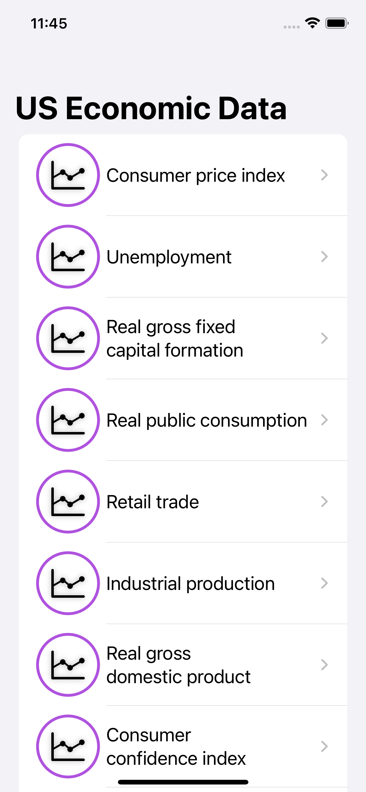
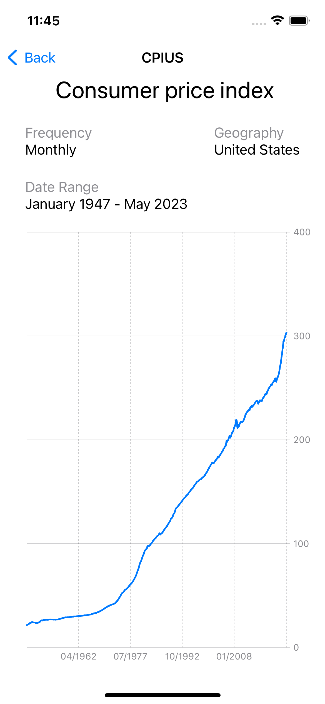

# Economic Data

This iOS app is built using SwiftUI and utilizes the Swift Charts library to display economic data fetched from [econdb](https://www.econdb.com/home).

## Features

- Fetches economic data from econdb API.
- Displays the fetched data using interactive charts powered by Swift Charts.
- Drag gestures allows users to interact with the chart by dragging their finger across the data points, displaying precise data at each point.
- Offers a user-friendly interface with intuitive navigation and interactions.

## Screenshots

### Home:



### Example Chart:



## Installation

### 1. Clone the repository

```bash
git clone https://github.com/michaelmagen/EconomicData.git
```

### 2. Navigate to the project directory

```bash
cd EconomicData
```

### 3. Build and Run

Build and run the app in Xcode by selecting your target device or simulator.
